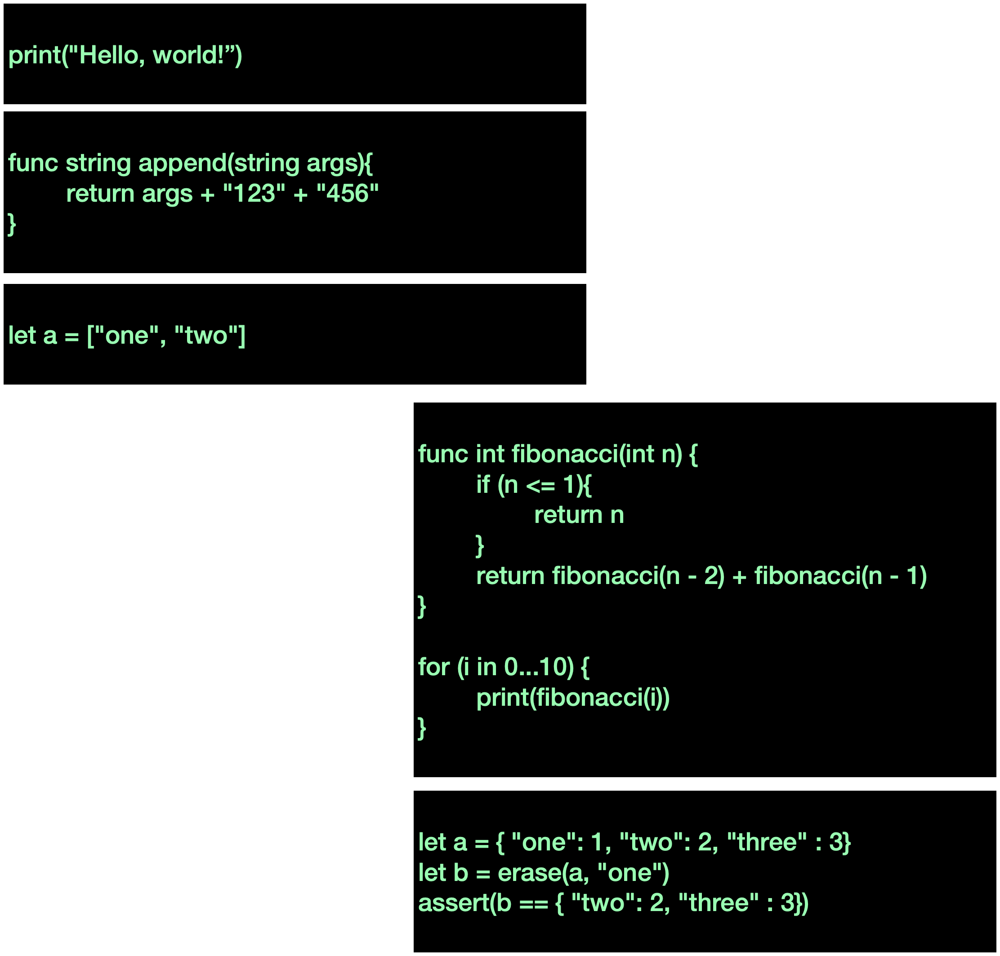
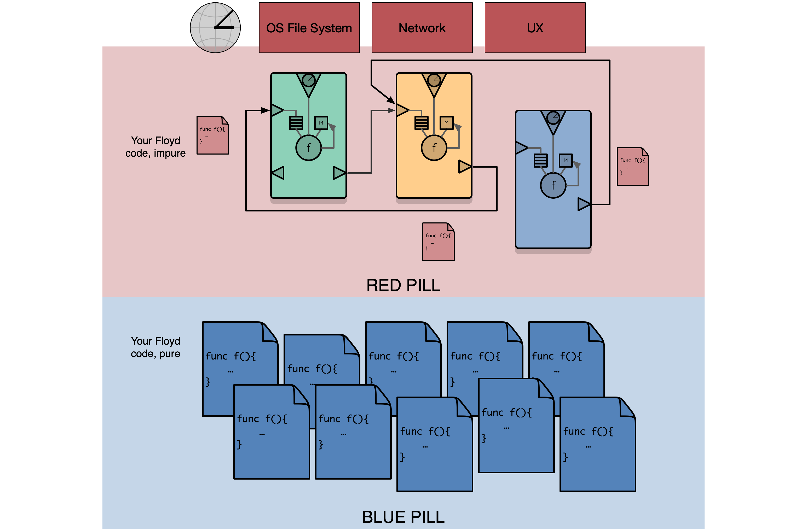
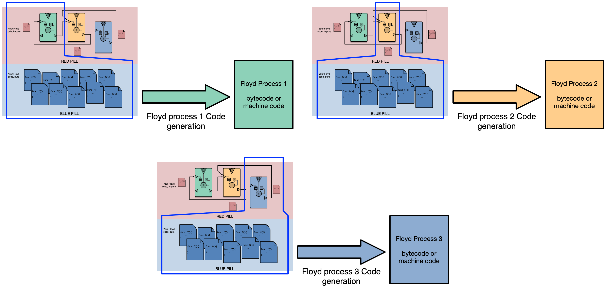

License: MIT

Status: Alpha. All the basics are finished. Runs on a bytecode interpreter. Will run natively soon. Production ready for smaller programs.

This repo holds the compiler, the bytecode interpreter and documentation.

# WHAT IS FLOYD?

Floyd is a general purpose programming language designed for making very large and robust programs that run really fast.

Floyds web page: [www.floydlang.org](https://www.floydlang.org "Floyd language's Homepage")

Floyd separates your program into three separate concerns:

1. Writing the program logic
2. Programming the interaction between your internal processes and the outside world
3. Mapping the program to the CPU and memory system

Floyd compilers and tools are written in C++ 17 and compiles with Clang and GCC.

## USE FOR

Use Floyd to build the next Photoshop, Grand Theft Auto or mobile app. But also for short scripts and toy programs. Probably not embedded software, though.

Floyd wants to replace C++, Rust, C#, Python. And Javascript. Only C can stay. Maybe Closure too, just out of respect.

## LANGUAGE SYNTAX

Floyd looks like Javascript and has a lot fewer features, syntax and quirks than most languages. Floyd is **statically typed** with **type inference**. It's got built in types for vectors, dictionaries, JSON, a struct type and strings. All values are **immutable** / **persistent data structures** using HAMT and other techniques.

It's a mashup of imperative, functional and OOP. Functions defaults to **pure** (but with normal local variables). TBD: protocol type allows polymorphism. There is no encapsulation (yet).

Floyd has no classes, no pointers / references, no tracing GC (uses copying and RC), no threads, mutexes, atomics and no header files. No Closures.

Later on, basic encapsulation, generics and lambdas may be added.

## CONCURRENCY, STATE AND THE WORLD

Processing and concurrency is done using Floyd's virtual processes and message passing. Each Floyd process has its own private state and are sandboxed. Floyd processes can interact with the world, calling OS APIs and accessing files.

## PARALLELISM

*(Implementation in progress)*

Safe parellelism is built in using map() reduce() filter and supermap(). Like shaders running on a GPU. They share an internal OS thread team with the Floyd processes.

## BYTECODE AND NATIVE

Floyd runs runs on a bytecode interpreter (now) and natively using LLVM (implementation in progress).

## OPTIMIZATION

*(Implementation in progress)*

You optimise your program by running it and *augmenting* your Floyd processe and their function call graph. Each process has its own optimisation settings. This automatically generates new optimized versions of lots of affected functions. This cannot introduce defects! Examples:

- Change memory layout of structs, order, split, merge, array-of-structs vs struct-of-arrays.
- Select backend for collections: a dictionary can be an array with binary search, a HAMT, a hash table or a red-black tree - all with different performance tradeoffs.
- Control thread priority, affinity, how many threads to use for the parallelization features.
- Insert read or write caches, introduce batching.

# STATUS

The essentials of Floyd are up and running and very robust (approx 1000 tests), including the concurrent Floyd processes. The compiler generates bytecode that runs at approx 5-10% of native speed on the interpreter. The manual is complete.

A handful features are needed for a satisfying 1.0: rounding out the language features somewhat and then *it's all about performance*.

# IN THE BOX

|Item				| Feature	
|:---				|:---
| [Floyd Speak Manual](floyd_speak.md) | Programming language manual
| [Core Library Manual](floyd_speak_corelibs.md) | File system access, JSON support, hashes, map() etc.
| [Floyd Systems Manual](floyd_systems.md) | How to use Floyd processes to change the world
| **Floyd compiler** | Compiles Floyd source code to byte code
| **Floyd bytecode interpreter**	|Runs your program

# LOOKING FORWARD

#### PERFORMANCE
- LLVM codegen
- Better internal threaded task manager
- Control over collection backend types, caching
- Visual profiler, debugger

#### LANGUAGE FEATURES
- More int and float types
- Sum-type (enum/union) with switch
- Proper support for libraries
- Protocol type
- Basic Unicode functions
- Binary packing of data
- C language integration
- Built-in REST library

