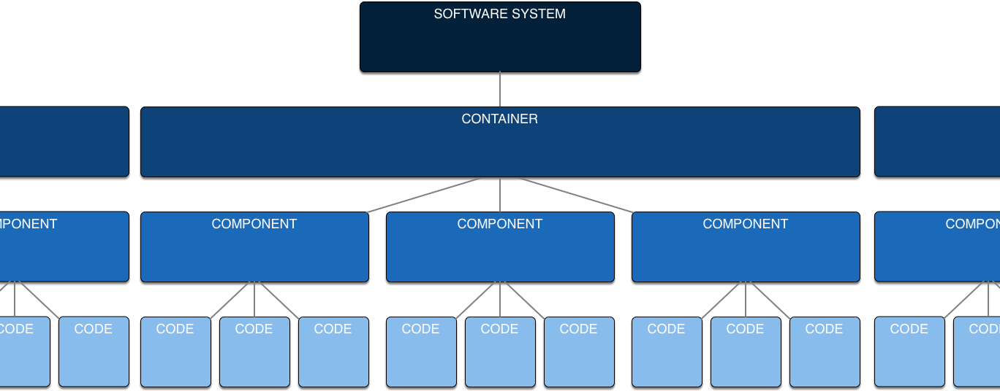
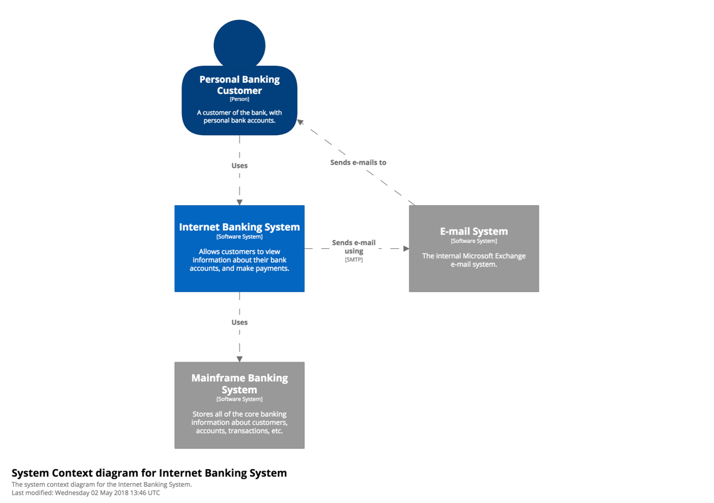
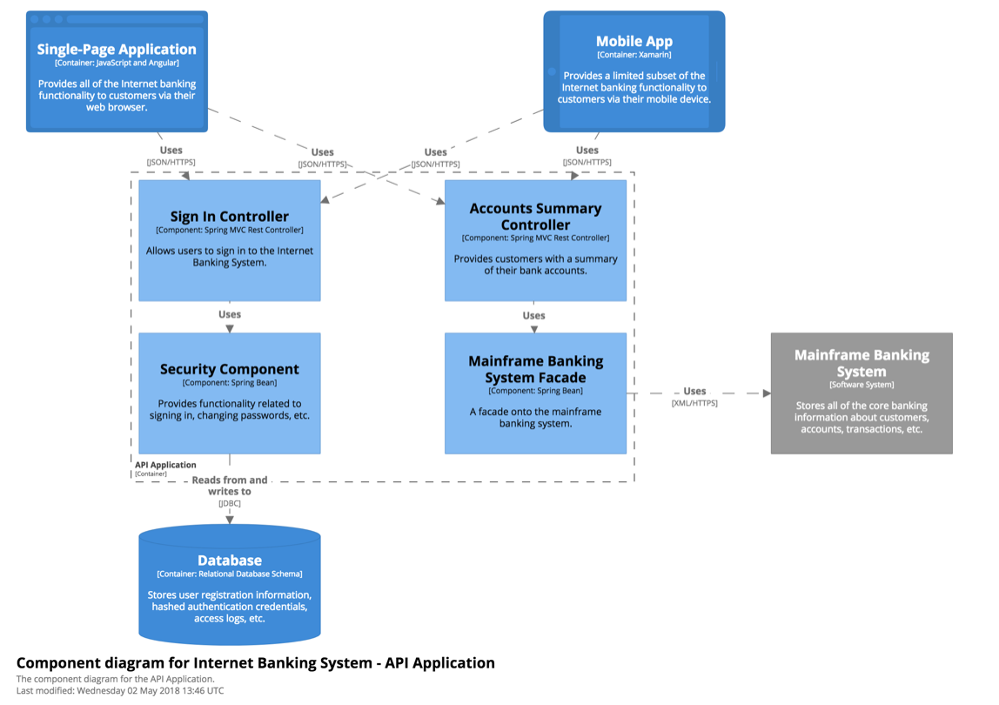
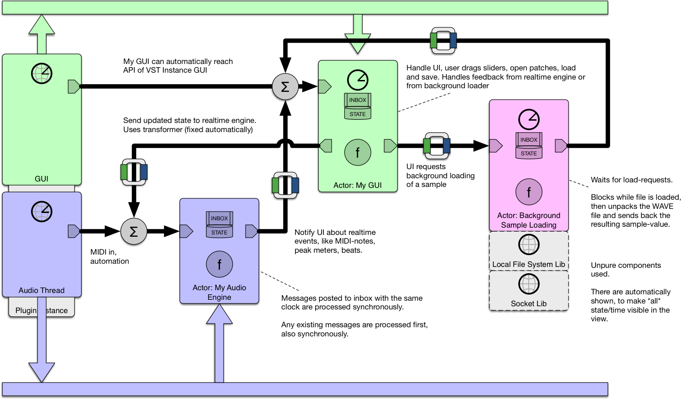
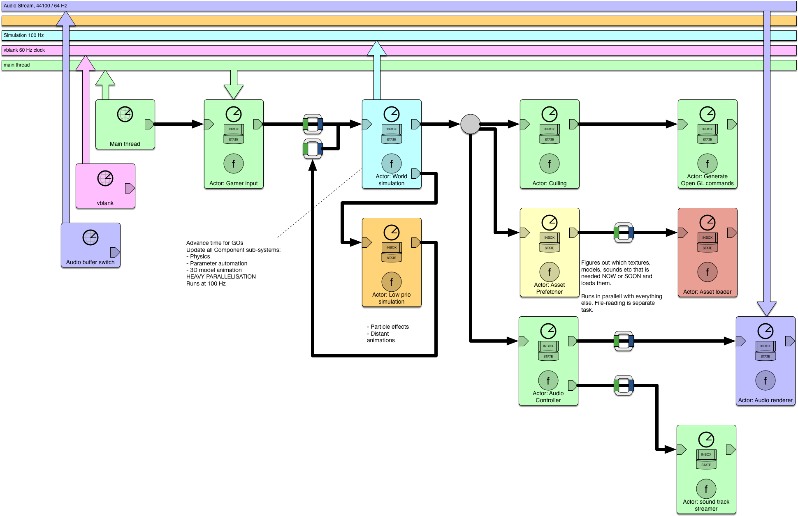

# FLOYD SYSTEMS MANUAL

Floyd Speak: this is the basic way to create logic. The code is isolated from the noise and troubles of the real world: everything is immutable and pure. Time does not advance. There is no concurrency or communication with other systems, no runtime errors.

Floyd Systems: this is how you make software that lives in the real world, where all those things happens all the time. Floyd allows you create huge, robust software systems that you can reason about, spanning computers and processes, handling communication and time advancing and faults. Floyd Systems are built ontop of Floyd Speak logic.

Floyd uses the C4 model to organize all of this. C4 model https://c4model.com/

GOALS

1. Allow you design reliable systems and reason about them. Systems with many computers, processes and threads -- concepts beyond functions, classes and modules. It represent those concepts through out: at the source code level, in debugger, in profiler etc.
2. Provide simple and robust methods for doing concurrency, communication, parallelisation, errors handling etc.
3. Allow extreme performance and profiling.
4. Support nextgen visual programming and interactions.

# ABOUT PERFORMANCE

Floyd is designed to make it simple and practical to make big systems with performance better than what you get with average optimized C code.

It does this by splitting the design into two different concepts:

1. Encourage your logic and processing code to be simple and correct and to declare where there is opportunity to execute code independely of eachother. This type of code is ideal to run in parallel or cache etc, like a shader in a graphics API.

2. At the top level, profile execution and make high-level improvements that dramatically alter how the code is *generated* and executed to run on the available hardware. Caching, collection type selection, batching, parallelisation, ordering work for different localities, memory layouts and access patterns.

It is also simple to introduce more concurrency to create more opportunities to run computations in parallel.

# ABOUT C4 CONCEPTS

A complete system is organised into parts like this:

### PERSON

Various human users of your software system. Uses some sort of user interface to the Software System. For example a UI on an iPhone.

### SOFTWARE SYSTEM

Highest level of abstraction and describes something that delivers value to its users, whether they are human or not, can be composed of many computers working together.

### CONTAINER

A container represents something that hosts code or data. A container is something that needs to be running in order for the overall software system to work. A mobile app, a server-side web application, a client-side web application, a microservice - all examples of containers.

This is usually a single OS-process, with internal mutation, time, several threads. It looks for resources and knows how to string things together inside the container. The basic building blocks are unpure-components, built in ones and ones you program yourself.

### COMPONENT

Grouping of related functionality encapsulated behind a well-defined interface. Like a software integrated circuit or a code library. Does not span processes. JPEG library, JSON lib. Custom component for syncing with your server. Amazon S3 library, socket library.

There are two types of components: pure and unpure.

- Pure components have no side effects, have no internal state and are passive - like a ZIP library or a matrix-math library.

- Unpure components may be active (detecting mouse clicks and calling your code) and may affect the world around you or give different results for each call and keeps their own internal state. get_time() and get_mouse_pos(), on_mouse_click(). read_directory_elements().

Pure components are preferable when possible. Sometimes you can 

??? TBD -- more details

### CODE

Classes. Instance diagram. Examples. Passive. Pure.

# ABOUT C4 DIAGRAMS

There is a set of standard diagram views for explaining and reasoning about your software. These lets you have a complete overview over your entire system and how users interact with it, then drill down to individual containers and further down to components and the code itself.

**Above, level 1: System Context diagram**

Above, level 2: Container diagram

Above, level 3: Component diagram

Above, level 4: Code

Notice: a component used in several containers or a piece of code that appears in several components will *appear in each*, seamingly like duplicates. The perspective of the diagrams is **logic dependencies**. These diagrams don't show the physical dependencies -- which source files or libraries that depends on each other.

# HELLO WORLD

??? TBD - code, all source files, mockup all diagrams.

# MORE ABOUT CONTAINERS

Containers are where you spend most of your time - along with writing the Floyd Speak code.

A mobile app is a container, so is the Django server on Heroku. A container is typically run as its own OS process.

The container *completely* defines *all* its: concurrency, state, communication with ourside world and runtime errors of the container. This includes sockets, file systems, messages, screens, UI.

There are often sibling containers in your system, like a server for your mobile game or data on Amazon S3. Containers may be implemented some other way or maybe canned solutions like Amazon S3, but should still be represented in Floyd Systems.

Containers are data files: they list the needed unpure-containers and wires them together and adds a few other types of parts, like clocks actors. When you design a container the focus is on the *unpure components*. Other components on which your used components depend upon are automatically shown too, if they are unpure. This makes *all* unpure components visible in the same view -- no unpureness goes on anywhere out of sight.

**Wires**: carry messages encoded as a Floyd value, typically a Floyd enum. Notice that the message can carry *any* of Floyd's types -- even huge multi-gigabyte nested structs or collections. Since they are immutable they can be passed around efficiently (internally this is done using their ID or hardware address).

**Actors** and **Clocks**: builtin mechanisms to define time and state.
**Probes** and **Tweakers**: these are added ontop of a design. They allow you to augument a design with logging, profiling, breakpoints and do advanced performance optimizations.

Example of compoenents you drop into your container:

- A component written in C
- Built in local file system component: Read and write files, rename directory, swap temp files (unpure)
- SVG Lib component (pure)
- ImageLib component (pure)
- Built in S3 component (unpure)
- Built in socket component (unpure)
- Built in UI-component (unpure)
- Built in command line component: Interfaces with command line arguments / returns (unpure)
- Audio component that uses Direct X (unpure)

Notice: these components are all non-singletons - you can make many instances in one container

The container's design is usually a one-off and cannot be composed into other containers. Almost always has side effects.

# MORE ABOUT CONCURRENCY AND TIME - INTRODUCING ACTORS

This is how you express time / mutation / concurrency in Floyd. These concepts are related and they are all setup at the top level of a container. Infact, the is the main **purpose** of a container.

The goal with Floyd's concurrency model is:

1. Simple and robust pre-made mechanisms for real-world concurrency need. Avoid general-purpose primitives.
2. Composable.
3. Allow you to make a static design of your container and its concurrency and state.
4. Separate out parallelism into a separate mechanism.
5. Avoid problematic constructs like threads, locks, callback hell, nested futures and await/async -- dead ends of concurrency.
6. Let you control/tune how many threads and cores to use for what parts of the system, independantly of the actual code.

Inspirations for Floyd's concurrency model are CSP, Erlang, Go routies and channels and Clojure Core.Async.

##### THREADING BACKGROUND

- **Hardware thread** - separate physical transistors that can execute code with a call stack. Typically 1 - 16 are available on a machine. They run all the time.

- **OS thread** - a separate thread of execution provided by the operating system. They are expensive, you typically should have less than 100 and they are expensive to schedule onto hardware threads by the OS. The OS schedules the OS threads onto available hardware threads and preemptively interrupts them regularly to give the hardware thread to another OS thread.

- **Green thread** -- virtual threads, each with their own callstack. These model the software concurreny and each represents something that can be run on a separate OS thread or hardware thread. How to actually run green threads is up to the runtime -- you don't know or care. This is a way to *expose* concurrency from your code. Green threads are mapped to OS threads by the Floyd runtime. It uses cooperative multitrasking to do this switching. Remember that 

- **Task** - a function that can execute independently when all its inputs are available. It can run on any type of thread.

A thread can take time to finish its work becase:

1. It is executing lots of instructions
2. It blocks on something external - waiting for data to arrive from the internet, slow RAM memory
3. It doesn't get clock cycles from the system

##### ACTORS: INBOX, STATE, PROCESSING FUNCTION

For each independant mutable state and/or "thread" you want in your container, you need to insert an Actor. Actors are statically instantiated in a container -- you cannot allocate them at runtime.

The actor represents a little standalone process with its own call stack that listens to messages from other actors. When an actor receieves a message in its inbox, its function is called (now or later) with the message and the actor's previous state. The actor does some work - something simple or a maybe call a big call tree or do blocking calls to the file system, and then it ends by returning its new state, which completes the message handling.

**The actor feature is the only way to keep state in Floyd.**

Use an actor if:

1. You want to be able to run work in parallel, like loading data in the background
2. You want a mutable state / memory
3. You want to model a system where things happens concurrently, like audio streaming vs main thread

The inbox is thread safe and it's THE way to communicate across actors. The inbox has these purposes:
	
1. Allow actor to *wait* for external messages using the select() call
2. Transform messages between different clock-bases -- the inbox is thread safe
3. Allow buffering of messages, that is moving them in time

You need to implement your actor's processing function and define its mutable state. The processing function is unpure. It can call OS-functions, block on writes to disk, use sockets etc. Each API you want to use needs to be passed as an argument into the processing function, it cannot go find them - or anything else.

Actors cannot change any other state than its own, they run in their own virtual adress space.

When you send messages to other actors you can block until you get a reply, get replies via your inbox or just don't use replies.

The actor function CAN chose to have several select()-statements which makes it work as a small state machine.

Actors are very inexpensive.

**Synchronization points between systems (state or concurrent) always breaks all attempts to composition. That's why Floyd has moved these to top level of container.**

The runtime can chose to execute actors on different cores or servers. You have control over this via tweakers. Tweakers also controls the priority of actors vs hardware.

Actor limitations:

- Cannot find assets / ports / resources — those are handed to it via the container's wiring
- Cannot be created or deleted at runtime
- Cannot access any global state or other actors

##### SYNCHRONOUS ACTORS

If the actors are running on the same clock, the message post - receive - processing is synchronously in the same thread, like a function call. Internally, the thread posting a message to actor's inbox then continues by executing the actor's function to receive and handle the message). These types of actors still have their own state and can be used as controllers / mediators -- even when it doesnt need its own thread *or you want it to run synchronously*.

### GAIN PERFORMANCE VIA CONCURRENCY

Sometimes we introduce concurreny to make more parallelism possible: multithreading a game engine is taking a non-concurrent design and making it concurrent to be able to improve throughput by running many tasks in parallel. This is different to using concurrency to model real-world concurrency like UI vs background cloud com vs realtime audio processing.

### CONCURRENCY SCENARIOS

|#	|Need		|Traditional	|Floyd
|---	|---			|---			|---
|1	| Make a REST request	| Block entire thread / nested callbacks / futures / async-await | Just block. Make call from Actor to keep caller running
|2	| Make a sequence of back and forths with a REST server | Make separate thread and block on each step then notify main thread on completion / nested futures or callbacks / await-async | Make an Actor that makes blocking calls
|3	| Perform non-blocking unpure background calculation (auto save doc) | Copy document, create worker thread | Use actor, use data directly
|4	| Run process concurrently, like analyze game world to prefetch assets | Manually synchronize all shared data, use separate thread | Use actor -- data is immutable
|5	| Handle requests from OS quickly, like call to audio buffer switch process() | Use callback function | Use actor and set its clock to sync to clock of buffer switch
|6	| Improve performance using concurrency + parallelism / fan-in-fan-out / processing pipeline | Split work into small tasks that are independant, queue them to a thread team, resolve dependencies some how, use end-fence with completetionnotification | call map() or supermap() from an Actor.
|7	| Spread heavy work across time (do some processing each game frame) | Use coroutine or thread that sleeps after doing some work. Wake it next frame. | Actor does work. It calls select() inside a loop to wait on next trigger to continue work.
|8	| Do work regularly, independant of other threads (like a timer interrupt) | Call timer with callback / make thread that sleeps on event | Use Actor that calls post_at_time(now() + 100) to itself
|9	| Small server | Write loop that listens to socket | Use Actor that waits for messages

# ABOUT PARALLELISM

In floyd you accellerate the performance of your code by making it expose where there are dependencies between computations and where there are not. Then you can orcestrate how to best execute your container from the top level -- using tweak probes and profiling probes, affecting how the hardware is mapped to your logic.

Easy ways to expose parallelism is by writing pure functions (their results can be cached or precomputed) and by using functions like map(), fold(), filter() and supermap(). These function work on individual elements of a collection and each computation is independant of the others. This lets the runtime process the different elements on parallel hardware.

??? make pipeline part. https://blog.golang.org/pipelines

The functions map() and supermap() replaces FAN-IN-FAN-OUT-mechanisms.

You can inspect in code and visually how the elements are distributed as tasks.

supermap() works like map(), but each element also has dependencies to other elements in the collection.

Accelerating computations (parallelism) is done using tweaks — a separate mechanism. It supports moving computations in time (lazy, eager, caching) and running work in parallel.

Often actors and concurrency is introduced into a system to *expose opportunity* for parallelism.

The optimizations using tweaks in no way affect the logic of your program, only the timing and order where those don't matter.

To make something like a software graphics shaders, you would do

let image2 = map(image1, my_pixel_shader) and the pixels can be processed in parallel.

**Task** - this is a work item that takes usually approx 0.5 - 10 ms to execute and has an end. The runtime generates these when it wants to run map() elements in parallel. All tasks in the entire container are schedueled together.

Notice: map() and supermap() shares threads with other mechanisms in the Floyd runtime. This mean that even if your tasks cannot be distributed to all execution units, other things going on can fill those execution gaps with other work.

# EXAMPLE SETUPS

### SIMPLE CONSOLE PROGRAM

??? TBD

This is a basic command line app, have only one clock that gathers ONE input value from the command line arguments, calls some pure Floyd Speak functions on the arguments, reads and writes to the world, then finally return an integer result. A server app may have a lot more concurrency.
main() one clock only.

### EXAMPLE: VST-plugin

??? TBD: make example of *all* the diagrams, including Software System diagram.

### FIRST PERSON SHOOTER GAME

??? TBD: make example of *all* the diagrams, including Software System diagram.

https://www.youtube.com/watch?v=v2Q_zHG3vqg

A video game may have several clocks:

- UI event loop clock
- Prefetch assets clock
- World-simulation / physics clock
- Rendering pass 1 clock
- Commit to OpenGL clock
- Audio streaming clock

This game does audio and Open GL graphics. It runs many different clocks. It uses supermap() to render Open GL commands in parallel.

